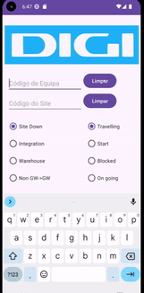

# DIGI App O & M
This APP It is not official DIGI APP.
### I am just helping my friends and learnning about Android programming.

## Objective
As required by some friends who work in telecommunications for the operator DIGI which is operating in Portugal now. I created an APP to carry out communications in a better way.
Actually They need to send a lot of WhsatsApp messages. As It is very hard and complicate, this app will facilitate the task.

## Reason
As an informatic engeneering student an i decide to acept the challange and begin my Android journey.

## Requeriments
It is just necessary to know what is needed to send, and then the smartphone makes the rest.
There is no information related to field teams or company for security reasons.

## Functoning
### It's necessary to select / insert the next data:

* Team Code
* Site Code
* Task type selector
* Task status selector

 

## Enable Funcions
 
* SMS creator in text box
* Direct message on WhatsApp
* SMS copy after generated

## Disable Functions

* Share Button

## Future Features

* QR Code Read and storage data
* Local storage
* Send Pictures with WhatsApp
